#  3-Tier Web Application Deployment on AWS  
### Manual DataBase  Server + Relational DataBase + Application Load Balancer+ Auto Scaling
### This project deploys a Java-based 3-tier web application on AWS, featuring a secure and scalable setup using NGINX (Jump Server), Tomcat (App Server), and MySQL (RDS). It includes Auto Scaling, Application Load Balancer (ALB), and custom VPC networking to ensure high availability, performance, and secure inter-tier communication

---
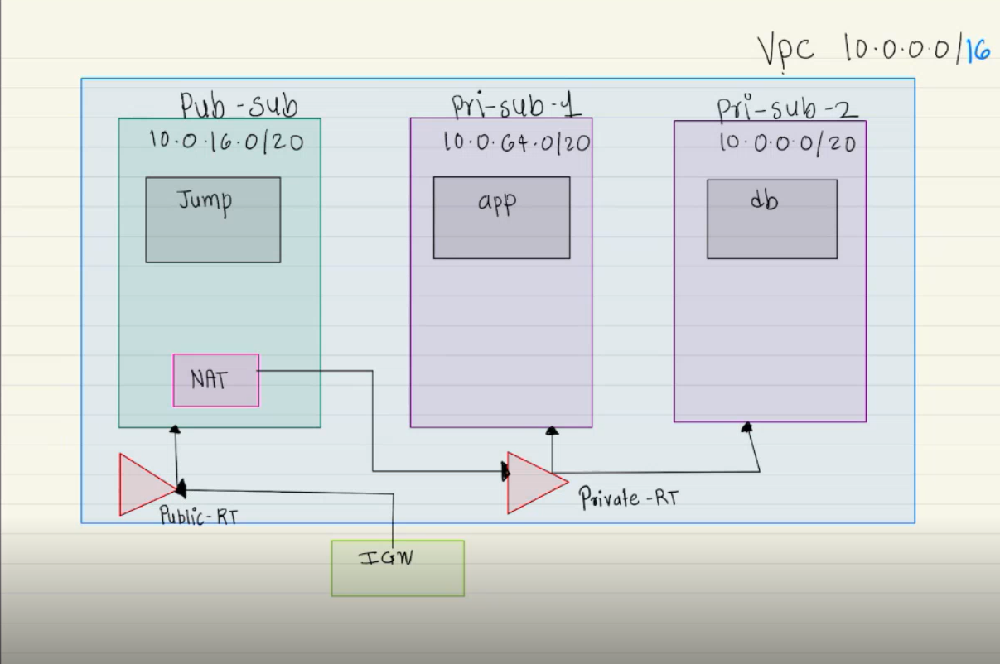

##  Project Overview

This project deploys a Java-based 3-tier web application on AWS with:

- **Presentation Layer** → NGINX on Jump Server (Public Subnet)
- **Application Layer** → Tomcat (WAR deployed in EC2 Auto Scaling Group)
- **Data Layer** → Manual DB Server EC2 (MariaDB client) connects to RDS (MySQL)

---

##  Architecture Summary

| Layer         | Component                                   | Subnet            |
|---------------|----------------------------------------------|-------------------|
| Presentation  | Jump Server (NGINX)                         | Public Subnet     |
| Application   | Tomcat EC2 in Auto Scaling Group            | Private Subnet 1  |
| Data          | DB EC2 + RDS (MySQL)                        | Private Subnet 2  |

---

##  Security Groups

| Name      | Inbound Rules               | Source               |
|-----------|-----------------------------|----------------------|
| Jump SG   | TCP 22 (SSH), 80 (HTTP)     | Your IP              |
| App SG    | TCP 8080                    | ALB SG               |
| ALB SG    | TCP 80                      | 0.0.0.0/0            |
| DB SG     | TCP 3306 (MySQL)            | App SG               |

---

##  Networking (VPC Setup)

1. **VPC**: `10.0.0.0/16`
2. **Subnets**:
   - Public Subnet: `10.0.0.0/20`
   - Private Subnet 1 (App): `10.0.16.0/20`
   - Private Subnet 2 (DB): `10.0.32.0/20`
   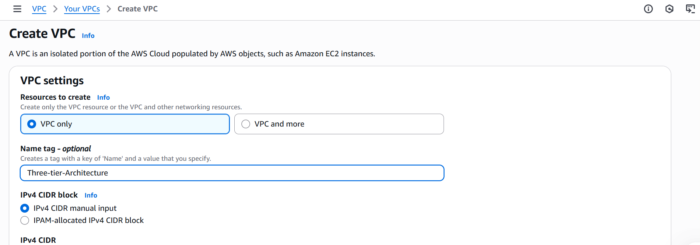
3. **Internet Gateway**: Attach to VPC
4. **NAT Gateway**: Create in Public Subnet (use Elastic IP)
5. **Route Tables**:
   - Public Route Table → `0.0.0.0/0 → IGW`
   - Private Route Table → `0.0.0.0/0 → NAT`

---

##  RDS Setup (MySQL)

1. Go to **RDS > Create Database**
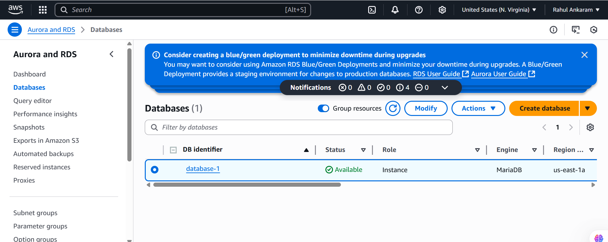
2. Choose **MySQL**
3. DB Name: `studentapp`
4. Username: `admin`, Password: `redhat123!`
5. Subnet Group: Private Subnet 2
6. Attach **DB SG**

Save the ***RDS Endpoint***.


---

## 🖥️ Manual DB Server (EC2) Setup

1. Launch an EC2 in **Private Subnet 2**
2. Attach **DB SG**
3. Connect via **Jump Server**:
   ```bash
   ssh -i key.pem ec2-user@<DB-Private-IP>
   ```
4. Install MariaDB client:
#### bash
```
 sudo yum install mariadb105 -y
```
5. Connect to RDS (use ***RDS Endpoint***):

bash
```
sudo mysql -h <RDS-ENDPOINT> -u admin -p
```
Inside MySQL:
```
CREATE DATABASE studentapp;
USE studentapp;

CREATE TABLE students (
    student_id INT AUTO_INCREMENT PRIMARY KEY,
    student_name VARCHAR(100),
    student_addr VARCHAR(100),
    student_age VARCHAR(3),
    student_qual VARCHAR(20),
    student_percent VARCHAR(10),
    student_year_passed VARCHAR(10)
);
```
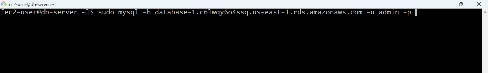
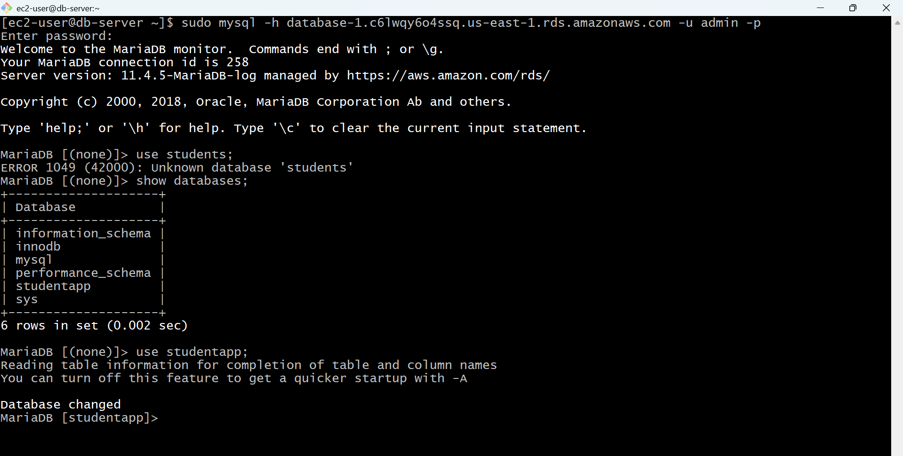
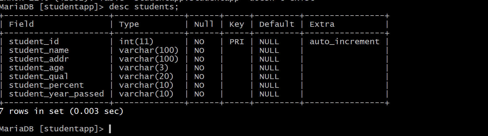
## **Launch Template (App EC2)**
1.Go to EC2 > Launch Templates > Create
Use this User Data:
```
#!/bin/bash
yum update -y
yum install java -y
cd /home/ec2-user
curl -O https://dlcdn.apache.org/tomcat/tomcat-9/v9.0.98/bin/apache-tomcat-9.0.98.tar.gz
tar -xvf apache-tomcat-9.0.98.tar.gz
mv apache-tomcat-9.0.98 /opt/tomcat
curl -O https://s3-us-west-2.amazonaws.com/studentapi-cit/student.war
curl -O https://s3-us-west-2.amazonaws.com/studentapi-cit/mysql-connector.jar
cp student.war /usr/local/tomcat/webapps/
cp mysql-connector.jar /opt/tomcat/lib/
/opt/tomcat/bin/startup.sh
```
## ***Target Group + ALB***
**1. Create Target Group :**

- Type: Instance

- Protocol: HTTP

- Port: 8080

- Health Check Path: /

**2. Create Application Load Balancer (ALB) :**

- Type: Internet-facing

- Listener: Port 80 → Forward to Target Group

- Attach ALB SG

**Save the ALB DNS Name**

## **Auto Scaling Group (ASG)**
- Go to EC2 > Auto Scaling Group > Create

- Use Launch Template from earlier

- Subnet: Private Subnet 1

- Attach to Target Group

- Scaling Policy:

              *  Desired: 2

              * Min: 1

              * Max: 4

              *  Target CPU > 50%

 ## Jump Server Setup (Public)
 1. Launch EC2 in Public Subnet

 2. Attach Jump SG

 3. SSH into it:

bash
```
ssh -i key.pem ec2-user@<Jump-Public-IP>
```
4. Install NGINX:
#### bash
```
   sudo yum install nginx -y
   sudo vim /etc/nginx/nginx.conf
```
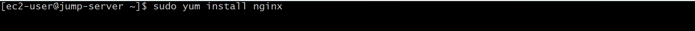

5. In location / block:
#### bash
```
location / {
    proxy_pass http://<ALB-DNS-Name>
}
```
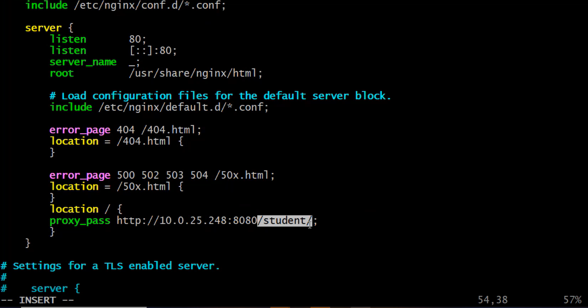
6. Save and restart NGINX:
#### bash
```
sudo systemctl restart nginx
```
### Tomcat DB Connection Configuration
On your application EC2 instances:

1. Edit context file:
#### bash
```
sudo vim /opt/tomcat9/conf/context.xml
```

2.Add inside <Context>:
#### bash
```
<Resource name="jdbc/TestDB" auth="Container"
          type="javax.sql.DataSource"
          maxTotal="500" maxIdle="30" maxWaitMillis="1000"
          username="admin" password="redhat123!"
          driverClassName="com.mysql.jdbc.Driver"
          url="jdbc:mysql://<RDS-ENDPOINT>:3306/studentapp?useUnicode=yes&characterEncoding=utf8"/>
```
3. Save and restart Tomcat:
#### bash
```
cd /opt/tomcat9/bin
./catelina.sh stop
./catelina.sh start
```
 ### Test the Application
 1. Open a web browser and navigate to the ALB DNS name.
 2. You should see the Tomcat application running on the ALB DNS name.

 ### OUTPUT
 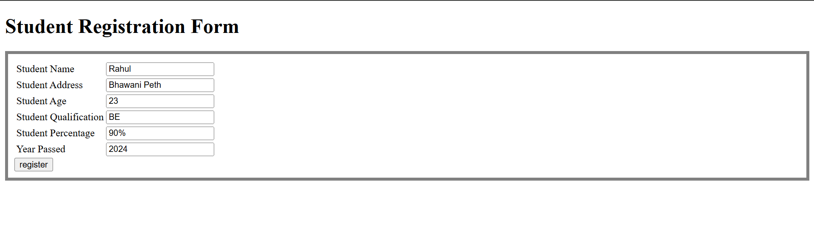
 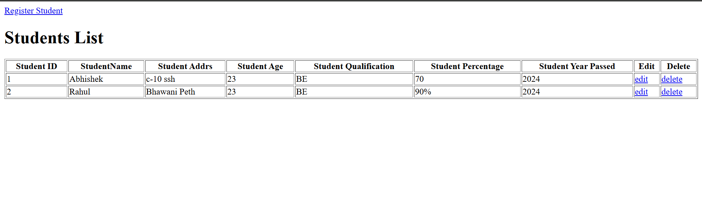
 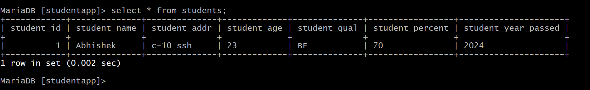
 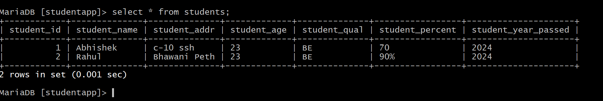
 
 ## Summary
 This project demonstrates the deployment of a 3-tier Java web application on AWS using EC2, RDS, ALB, and Auto Scaling. The architecture includes an NGINX Jump Server (public subnet) as the entry point, a Tomcat-based application layer (private subnet) managed by an Auto Scaling Group behind an ALB, and a MySQL RDS database (private subnet) accessed via a MariaDB client on an EC2 instance. The setup ensures high availability, scalability, and secure communication across layers using VPC networking, NAT, and strict Security Groups.